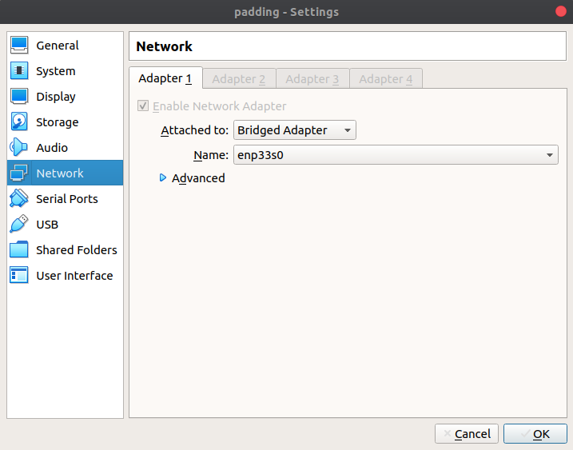
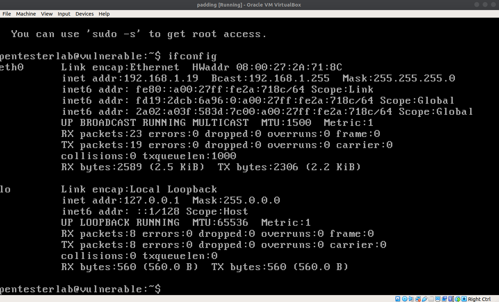
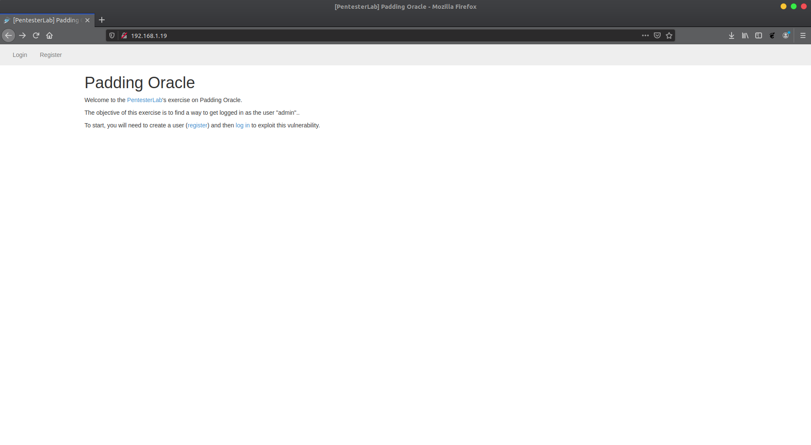
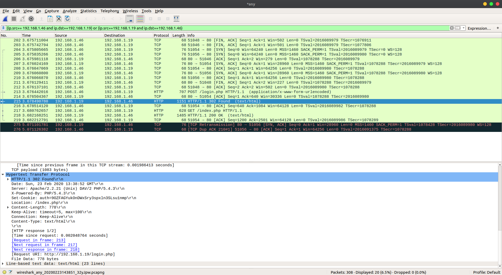
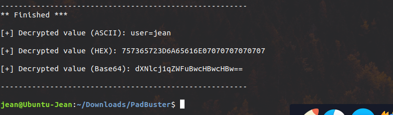
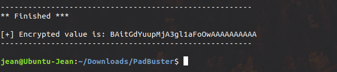
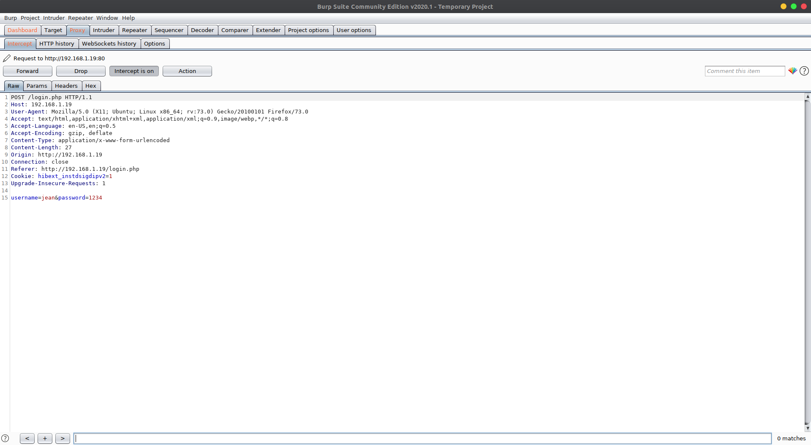
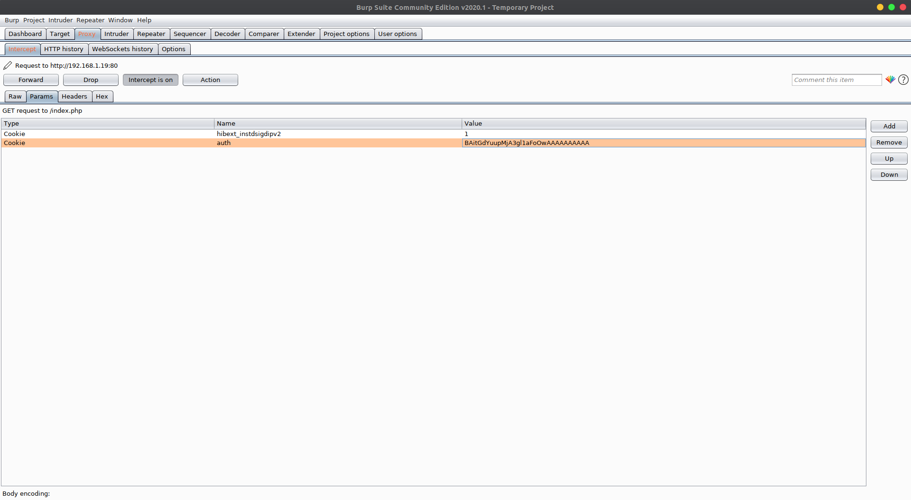

# Pentester Lab: Padding Oracle :computer:

In order to make a padding oracle attack, you need to find a tarket. To avoid legal issue, we are going to build one. To do so, we use a virtual machine that will play the role of the server running the vulnerable web application. 

## Setup a vulnerable virtual machine

1. First you need to install virtualbox and download the vulnerable iso file form [VulnHub](https://www.vulnhub.com/entry/pentester-lab-padding-oracle,174/).

2. Create a virtual machine using virtualbox with the "padding_oracle.iso" file. Choose Linux 2.6/ 3.x/ 4.x for the operating system.

3. In virtualbox, go to Settings then Network. Enable a network adapter and attach it to a bridged adapter.

4. Start the virtual machine.

## Go to the vulnerable website
1. First you need to know were to go, so in the virtual machine type `ifconfig`. You can see on the second line after `inet addr:` the ip address of the vulnerable.

2. Open your web browser and type the ip in the adress bar.

3. Click on register and create an account then click on logout.

## It's now time to hack :nerd_face:

### Find some data
1. You need to install [Wireshark](https://www.wireshark.org/).

2. Start a capture by double clicking on `any` and then on the .

3. Go back on your browser and login to the website.

4. Stop the wireshark capture by cliking on the red square.

5. Know you need to apply a filter to the capture. Click on `filter` and type `(ip.src== \* the ip of you pc \* and ip.dst==\* the ip of the server \*) or (ip.src==\* the ip of the server \* and ip.dst==\* the ip of you pc \*)`. You can find your ip adress by type in the terminal `ipconfig` on windows and `ifconfig` on linux and macOS.

6. You need to find the right frame. Find an frame with HTTP as protocol going from the server to your comtuper. In the info collum, you will see "Found" (text/html). Click on this frame then on the triangle next to `Hypertext Transfer Protocol`.

7. You shoud have some think like this : 

8. Find the Set-Cookie line and copy the text after the colon. Some think like : `auth=9OZFAGYukOnDWxSry3spxln3SLsu1nmp`.

9. If you restart an capature and relog into the website this Set-Cookie value will always remain the same. It's a padding oracle.

### Crack the authification cookie

1. Install Perl

2. Open a terminal an type `git clone https://github.com/AonCyberLabs/PadBuster.git` then `cd PadBuster`.

3. Install libcrypt-ssleay-perl by typing `sudo apt-get install libcrypt-ssleay-perl`

4. Type `perl padBuster.pl http://*The ip address of the server*/login.php *the Set-Cookie value without auth=* 8 --cookie *the Set-Cookie value with auth=* --encoding 0`

5. Select the marked ID.

### Reencrypt the data

1. Type `perl padbuster.pl http://172.16.129.131/login.php *the Set-Cookie value without auth=* 8 --cookies auth=*the Set-Cookie value with auth=* --encoding 0  -plaintext user=admin`.

2. Copy the encrypted value.

### Modify your request

1. Install Burp Suite

2. Set up your browser to work with Burp Suite ([Tutorial link](https://portswigger.net/support/configuring-your-browser-to-work-with-burp)).

3. When you try to login, you should have this

4. Forward the request until you see one with Cookie : auth=\*some random letters\*

5. Click on Params -> click on the cookie param with 'auth' as name. Replace the actual value with the encrypted value you have copied.

6. Forward the request and set the intect on off.

7. Open the browser. You are now login as admin. :sunglasses:

